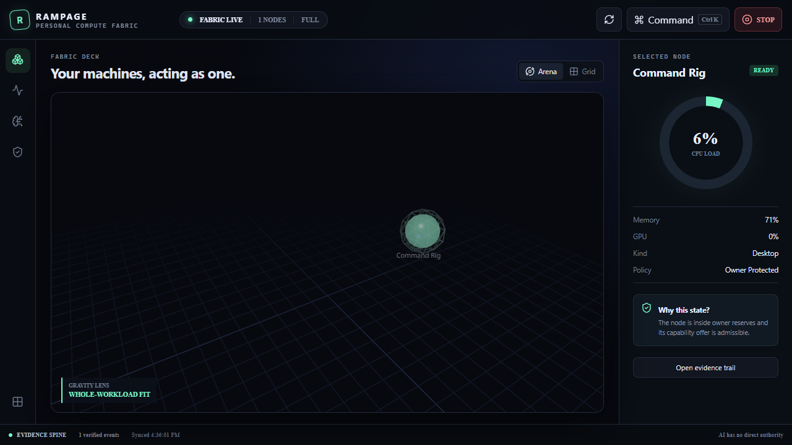
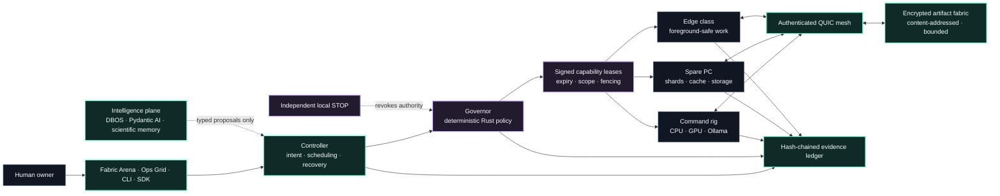
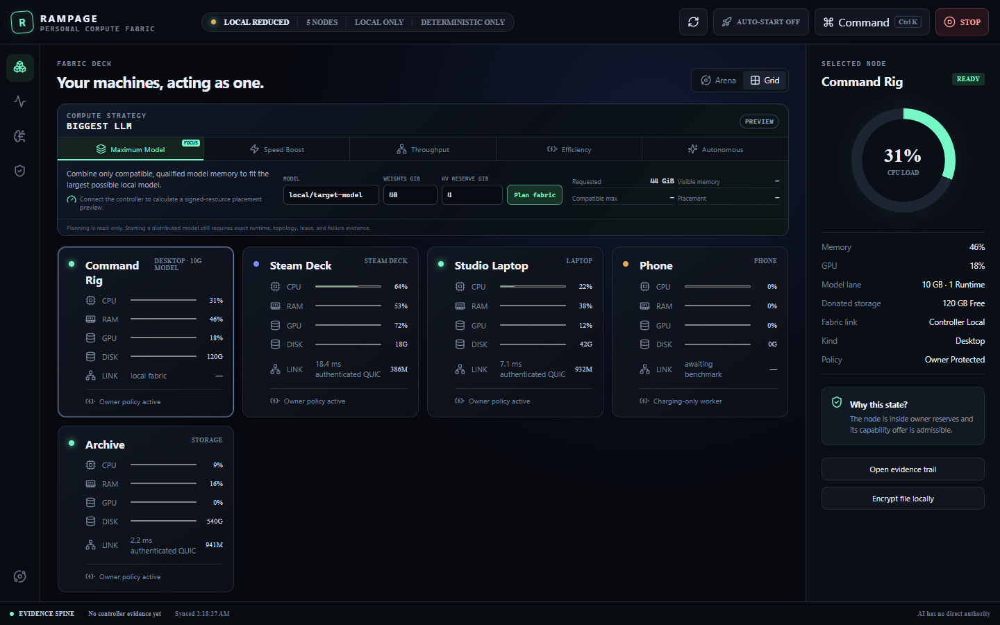

<div align="center">

# RAMPAGE

### Your machines. One governed compute organism.

**Recursive Autonomous Mesh for Policy-Aware Acceleration, Governance, and Evolution**

Rampage turns the hardware you already own into a private, evidence-bearing compute fabric—then
adds an autonomous intelligence layer that can improve how work is planned without ever inheriting
the authority to run wild.

[](https://github.com/ObtuseAI/rampage/actions/workflows/ci.yml)
[](https://github.com/ObtuseAI/rampage/actions/workflows/codeql.yml)
[](docs/PLATFORM_MATRIX.md)
[](Cargo.toml)
[](docs/ARCHITECTURE.md#recursive-improvement)

[**Launch the showcase**](https://obtuseai.github.io/rampage/) ·
[Architecture](docs/ARCHITECTURE.md) ·
[Security](SECURITY.md) ·
[Release evidence](docs/RELEASE_EVIDENCE.md)

</div>



## This is what personal compute should feel like

Install Rampage on an owner PC. Install it on another machine. Paste one short-lived signed invite.
Rampage discovers usable CPU, GPU/VRAM, RAM, storage, power, thermals, runtimes, and local Ollama
models automatically—then moves bounded work to the machine that can actually perform it.

No Tailscale account. No fictional “global RAM.” No mystery daemon with unlimited authority. No AI
agent holding the keys to its own guardrails.

| The old constraint | The Rampage move |
| --- | --- |
| A powerful desktop sits idle while another machine struggles | Place the whole job on the best available node |
| Small machines cannot host the full workload | Give them restart-tolerant shards, preprocessing, evaluation, cache, or relay work |
| Donated disks become brittle network mounts | Turn them into encrypted, content-addressed artifact capacity |
| “Autonomy” quietly becomes administrator access | Let intelligence propose; let deterministic Rust policy decide |
| Distributed systems fail opaquely | Sign leases and receipts, fence stale work, and write every transition to a hash chain |
| A kill switch depends on the system it is stopping | Keep STOP local, non-agentic, and independent of the controller and network |

> **The result:** more useful compute, less wasted hardware, and an autonomous system whose ambition
> is separated from its authority by construction.

## Built—not imagined

Rampage 0.2 is a working Windows x64 release candidate with evidence for the paths it claims.

| Proof surface | Validated result |
| --- | --- |
| Trust kernel | Scoped Ed25519 leases; durable one-shot nonces; restart-safe monotonic epochs; STOP fencing; fail-closed admission |
| OnePool | Three independent evaluation shards placed across bounded offers, completed with signed results, and recovered after restart |
| Private mesh | Authenticated direct QUIC enrollment, control traffic, and artifact transport without a Tailscale dependency |
| Storage fabric | Encrypted chunked CAS, signed storage leases, automatic input staging, replication, retrieval, and receipt outputs |
| Real AI workload | OpenAI-compatible chat crossed authenticated QUIC to a worker's loopback Ollama, streamed back, and ended in a transcript-matched signed receipt |
| Compute Strategy | Read-only Maximum Model, Speed Boost, Throughput, Efficiency, and Autonomous placement previews with exact capacity and qualification blockers |
| Packaged product | Native Tauri shell, role-aware system tray, close-to-tray, start-at-login, four sidecars, clean explicit shutdown, installer, and automatic desktop launcher |
| Verification | 60 Rust tests plus desktop, TypeScript SDK, Python intelligence, Python SDK, deterministic model-gateway, mesh, packaging, and lifecycle gates |

The complete qualification record—including artifact hashes and the unsigned-release boundary—is in
[the release evidence](docs/RELEASE_EVIDENCE.md).

## The design graph



The narrow waist is the capability lease. Interfaces above it can become dramatically smarter;
devices and engines below it can become dramatically more diverse. Neither change bypasses policy.

That waist is durable, not merely signed. A normal controller restart preserves the current
authority generation and recoverable work. Owner STOP advances the hash-chained generation;
controllers reject old claims and receipts, while workers and artifact gateways persist consumed
nonces and the highest epoch they have observed so replay remains denied after restart.

## OnePool: pool the work, not the address space

Remote memory and VRAM do not become magically coherent across commodity networks. Rampage instead
pools the parts that are useful in the real world:

1. Place a complete workload on one capable device.
2. Split independent map, evaluation, rendering, preprocessing, or search tasks into a bounded shard set.
3. Add replicas where throughput or evidence benefits.
4. Prefer data-local execution and encrypted artifact movement.
5. Admit multi-GPU or cross-host model sharding only after a specific engine/topology adapter proves it wins.

Phones and tablets are not pretend GPU servers. Their best future contribution is thermally bounded,
foreground, restart-tolerant work: data preparation, scoring, validation, sensor processing, relay,
cache, and small-model inference. Console support remains constrained by platform-holder policy.

## Model Fabric: biggest model and fastest chat are different lanes

The desktop now defaults to **Maximum Model** and exposes five explicit ways to use added compute:

| Toggle | What Rampage optimizes |
| --- | --- |
| Maximum Model | Largest compatible aggregate model-memory placement |
| Speed Boost | Fastest evidence-supported single chat; slow distributed links are rejected |
| Throughput | Independent replicas for many concurrent users or agents |
| Efficiency | Smallest qualified placement that fits |
| Autonomous | Proposal-only strategy adaptation behind Governor gates |

The planner reports visible versus compatible memory, requested weights plus KV cache, selected
ranks, parallelism, predicted speedup, and the exact missing qualification. Planning remains
read-only. Separately, the shipped whole-model lane can select an exact installed Ollama model on
one contributor, mint a one-shot model-session lease, stream it over authenticated QUIC, and expose
the result through a bearer-protected OpenAI Chat Completions subset. Cross-host tensor and pipeline
launch remain gated until a backend proves runtime, topology, isolation, recovery, and measured
benefit.

```powershell
rampage model-plan local/70b-quantized --weights-gib 40 --kv-cache-gib 4 --strategy maximum-model-size
rampage model-plan local/fast-chat --weights-gib 20 --kv-cache-gib 2 --strategy speed-boost
```

See [Model Fabric](docs/MODEL_FABRIC.md) for the contracts, planner rules, topology thresholds, and
the executable-backend boundary.



## Recursively improving—without recursively expanding authority

The intelligence plane runs a durable improvement loop:

`Record → Analyze → Mutate → Prove → Audit → Gate → Enshrine`

DBOS workflows make the process recoverable. Pydantic AI adapters produce typed proposals. Scientific
memory keeps experiments content-addressed. Deterministic replay, holdouts, adversarial review,
replication, shadow, and canary gates determine whether an idea earns promotion.

The model cannot mint leases, enroll peers, edit the Governor, access signing keys or secrets,
promote itself, authorize destructive tools, change financial policy, or bypass STOP. Missing or
ambiguous evidence fails closed.

## Optional DumbMoney cell

Rampage can operate universally or attach as an infrastructure cell for DumbMoney. That bridge is a
deliberately narrow external trust boundary: read-only telemetry enters Rampage; signed proposals
return. Trading, capital, credentials, live databases, promotion, and policy authority never cross it.

## Start the fabric

1. Download the Windows installer from [Releases](https://github.com/ObtuseAI/rampage/releases).
2. Open the **Rampage** shortcut created on the Windows desktop.
3. Choose **Create my fabric** on the main machine.
4. Choose **Add machine**, then paste the complete signed invitation into Rampage on the other PC.
5. Leave contribution limits on automatic or tune them. Press **STOP** whenever you want the node back.

Closing the window keeps the governed fabric alive in the Windows system tray. Left-click the tray
icon to restore it, or right-click for role status, Start with Windows, emergency stop, and an
explicit Quit that releases the desktop-owned sidecars. Auto-start launches quietly into the tray.

The current binaries are unsigned release candidates. Verify the published SHA-256 checksums and
expect Windows reputation warnings until ObtuseAI publishes an Authenticode-signed build.

For a real local-model workload:

```powershell
rampage generate llama3.2:latest "Reply with RAMPAGE_OK" --gpu-memory-gb 4
```

Or point an OpenAI client at the owner PC's loopback gateway. The API key is the local Rampage
controller token; the desktop's **Copy API setup** button copies both values explicitly:

```python
from openai import OpenAI

client = OpenAI(base_url="http://127.0.0.1:47831/v1", api_key="RAMPAGE_TOKEN")
reply = client.chat.completions.create(
    model="llama3.2:latest",
    messages=[{"role": "user", "content": "Reply with RAMPAGE_OK"}],
)
print(reply.choices[0].message.content)
```

`GET /v1/models`, non-streaming and SSE `POST /v1/chat/completions`, and explicit session cancel
are implemented. Unknown fields, inconsistent model aliases, replayed leases, stale epochs,
oversized prompts, and unsigned terminal success all fail closed.

For useful pooled evaluation work:

```powershell
rampage shard-plan "1,2,3" "4,5,6" "7,8,9"
rampage shard-run "1,2,3" "4,5,6" "7,8,9" --minimum-successes 3
rampage shard-status SET_ID
```

Each argument is independently retryable. Rampage previews placement without mutation, admits the
entire set or none of it, and reports every selected node, signed receipt, result, and threshold.

Donated drives become explicit artifact capacity:

```powershell
$artifact = rampage artifact-put .\dataset.bin | ConvertFrom-Json
rampage artifact-replicate $artifact.digest NODE_ID
rampage artifact-hash $artifact.digest
```

## The system

| Surface | What it owns |
| --- | --- |
| `rampage-protocol` | Versioned resource, job, shard-set, model-session, mesh, lease, receipt, artifact, and evidence contracts |
| `rampage-policy` | The deterministic Governor, signatures, admission, fencing, STOP, and promotion gates |
| `rampage-controller` | Scheduling, recovery, atomic shard admission, local API, and mesh gateway |
| `rampage-agent` | Hardware discovery and allowlisted CPU/GPU/Ollama worker adapters |
| `rampage-mesh` | Rampage-owned Iroh/QUIC identities and bounded remote control frames |
| `rampage-storage` | Encrypted, chunked content-addressed storage and durability classes |
| `rampage-ledger` | Recoverable, paginated, hash-chained SQLite evidence |
| `apps/desktop` | Tauri/React spatial Fabric Arena and accessible Ops Grid |
| `services/intelligence` | Durable proposal-only DBOS/Pydantic AI improvement workflows |
| `packages/sdk-*` | Token-aware TypeScript and Python integration surfaces |
| `integrations/dumbmoney` | Read-only telemetry in; signed proposals out |

## Build and prove it

Requirements: Rust 1.91+, Node.js with pnpm 11, Python 3.12+ with `uv`, and Windows build tooling
for the packaged release.

```powershell
pnpm install
uv sync --project services/intelligence --extra dev
cargo test --workspace
pnpm check
uv run --project services/intelligence pytest services/intelligence/tests
./scripts/Test-Rampage.ps1
./scripts/Build-Rampage.ps1 -Profile release
./scripts/Smoke-RampageInstaller.ps1
```

`model-gateway-e2e.ps1` deterministically qualifies the gateway with a bounded fake loopback Ollama;
`ollama-e2e.ps1` can additionally exercise a real installed model. Generated outputs, installers,
sidecar binaries, databases, keys, and logs are excluded from source control.

## Read deeper

[Architecture](docs/ARCHITECTURE.md) ·
[Mesh and enrollment](docs/MESH.md) ·
[Edge policy](docs/EDGE_DEVICES.md) ·
[Operations](docs/OPERATIONS.md) ·
[Backend admission gates](docs/BACKEND_GATES.md) ·
[Model Fabric](docs/MODEL_FABRIC.md) ·
[Platform matrix](docs/PLATFORM_MATRIX.md) ·
[Security policy](SECURITY.md) ·
[Release evidence](docs/RELEASE_EVIDENCE.md)

## Publication and license boundary

Rampage 0.2 is designed for devices controlled by one owner or a deliberately trusted circle. It is
not a public compute marketplace and does not permit anonymous stranger-to-stranger resource sharing.

The repository is publicly inspectable but proprietary—not open source. See [LICENSE](LICENSE).

<div align="center">

### Stop wasting the machines you already own.

**Make them act as one—and make every unit of authority prove where it came from.**

</div>
