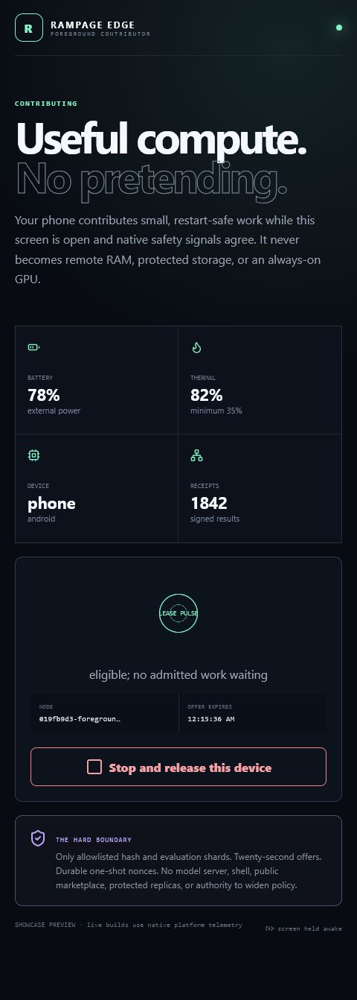

# Rampage Edge: phones and tablets that do useful work

Rampage Edge is a native Android/iOS contributor for small, independent, restart-safe work. It is
the honest way to recover useful compute from phones and tablets without calling them remote VRAM,
network RAM, protected storage, or an always-on model server.

The app has one operating mode: **explicit foreground donation**. The owner opens Rampage Edge,
enrolls once with a complete signed invitation, and presses **Start foreground donation**. A native
plugin supplies platform battery, charging, low-power, thermal, device-class, application-lifecycle,
and screen-awake state to the in-process Rust worker. Missing or unsafe telemetry denies the session.



The image is a browser-rendered showcase state of the real React interface. Packaged builds replace
the preview values with native Kotlin or Swift telemetry.

## What a mobile contributor can execute

The current source allowlist is intentionally tiny:

| Adapter | Operation | Execution shape | Why it fits an edge device |
| --- | --- | --- | --- |
| `rampage.hash.v1` | `hash` | Independent, preemptible shard | Bounded CPU work with a deterministic result |
| `rampage.eval-shard.v1` | `score` | Independent, preemptible shard | Small evaluation unit that can be retried elsewhere |

The offer contains CPU only. It advertises no RAM working set, VRAM, GPU, cache, scratch, protected
storage, model runtime, shell, relay, or public-marketplace capability. The local authority store has
zero bytes assigned to every storage class; it exists only to persist consumed one-shot nonces and
the highest fencing epoch the worker has observed.

Future preprocessing, sensor, small-model, media, or relay adapters must ship a bounded implementation
and pass their own qualification. A broad domain in the protocol schema never grants authority by
itself.

## The automatic safety envelope

Every pulse must satisfy every row:

| Signal | Required state | Failure behavior |
| --- | --- | --- |
| Platform | Native `android` or `ios` | Deny |
| Device class | Native `phone` or `tablet` | Deny |
| Lifecycle | Application active in the foreground | Native donation cleared; no new pulse |
| Owner intent | Donation still explicitly requested | Deny |
| Battery | At least 40%, unless external power is present | Stop and clear screen-awake state |
| Low-power mode | Off | Stop |
| Thermal headroom | At least 35% | Stop |
| Local STOP latch | Absent | Deny before networking or work |
| Signed offer lifetime | 20 seconds | Controller discards it after expiry |

There is no per-pulse approval prompt. The thresholds are deterministic and autonomous inside the
owner-defined envelope. A failed network or lease pulse forces a native stop in the UI; the app does
not keep presenting a stale green session and retry forever.

## Lifecycle and trust flow

```mermaid
sequenceDiagram
    participant O as Owner
    participant N as Native Kotlin or Swift
    participant E as In-process Edge worker
    participant M as Authenticated QUIC mesh
    participant C as Controller and Governor

    O->>N: Paste signed invite and press Start
    N->>E: Foreground, battery, power, thermal, device class
    E->>E: Create or load Ed25519 identity
    E->>M: Connect to signed controller endpoint
    M->>C: Signed one-time enrollment
    C-->>E: Enrolled identity accepted
    loop While foreground and safe
        N->>E: Re-read native signals
        E->>C: Signed 20-second CPU offer
        C-->>E: At most one freshly leased allowlisted claim
        E->>E: Persist nonce and fencing acceptance
        E->>C: Signed receipt, via durable outbox
    end
    N-->>E: Inactive, STOP, pressure, or failure
    E-->>C: No offer refresh; authority expires
```

First enrollment requires a fresh invitation whose controller route is signed by the Governor. The
device persists its Ed25519 key, enrolled identity, Governor key, and controller endpoint pin with
owner-only file permissions on mobile Unix platforms. On restart, the discovery advertisement may
be expired, but Rampage still re-verifies the stored route's Governor signature and pins the exact
controller endpoint key. Expiry is not reinterpreted as permission: the controller still requires
an enrolled peer and a fresh, scoped, one-shot, epoch-fenced lease for every operation.

The controller also rejects device-class laundering. Every resource in an offer must carry a
`device_kind` label matching the enrolled native identity, and phone/tablet offers must carry a
native battery observation. A signed offer cannot omit the mobile label to receive desktop policy.

## Native implementation

| Layer | Source | Responsibility |
| --- | --- | --- |
| Mobile UI | `apps/edge` | Enrollment, owner intent, live telemetry, lease pulse, STOP, hard-boundary explanation |
| Tauri shell | `apps/edge/src-tauri` | In-process commands and application-owned worker lifecycle |
| Android plugin | `crates/tauri-plugin-rampage-edge/android` | `BatteryManager`, `PowerManager`, lifecycle, and `FLAG_KEEP_SCREEN_ON` |
| iOS plugin | `crates/tauri-plugin-rampage-edge/ios` | `UIDevice`, `ProcessInfo`, lifecycle notifications, and idle-timer control |
| Edge runtime | `crates/rampage-edge` | Identity, enrollment, route pin, offers, claims, execution, receipts, and shutdown |
| Trust kernel | `rampage-policy`, `rampage-controller`, `rampage-storage` | Validation, identity binding, signed authority, durable nonce/epoch acceptance |

Android uses no background or foreground service. `onPause` clears owner intent and the screen-awake
flag immediately. The app can install on API 26+, but Android 8 and 9 remain donation-ineligible
because they do not expose the required process thermal status. Android's current guidance limits
background services and makes noticeable foreground services explicit; Rampage does not use that
mechanism to disguise ambient compute. See the official
[Android background limits](https://developer.android.com/about/versions/oreo/background) and
[foreground-service guidance](https://developer.android.com/develop/background-work/services/fgs).

iOS observes `willResignActive`, clears donation, and restores the normal idle timer. It declares no
background mode and schedules no `BGProcessingTask` or continuous-processing entitlement. Apple
normally suspends background applications and reserves extended execution for bounded,
system-mediated purposes; Rampage therefore makes no always-on iPhone compute claim. See Apple's
[background execution modes](https://developer.apple.com/documentation/Xcode/configuring-background-execution-modes)
and [Background Tasks framework](https://developer.apple.com/documentation/backgroundtasks).

## Packaging and qualification

The mobile workflow builds two source-bound candidates:

- an unsigned Android ARM64 APK on Ubuntu with Android 36, Java 21, Rust 1.91, and NDK
  `27.1.12297006`;
- an unsigned Apple Silicon iOS Simulator `.app` on macOS 15 with Xcode, CocoaPods, Rust 1.91, and
  the `aarch64-apple-ios-sim` target.

Both artifacts are structurally checked, packaged with SHA-256 checksums, and uploaded only as CI
candidates. An iOS simulator bundle is not a physical-device or App Store package. Android release
signing, Apple developer signing, store review, physical-device lifecycle tests, real battery and
thermal pressure campaigns, and long-duration network interruption tests remain separate release
gates. The [mobile evidence record](MOBILE_EDGE_EVIDENCE.md) binds the successful jobs to their
source and pull-request merge commits and records the downloaded candidate hashes and package metadata.

Gaming consoles are not part of this client. The Android manifest intentionally omits TV/Leanback
launcher declarations, and there is no console package or permission claim. Console support requires
platform-holder-approved SDKs, distribution, background rules, and an operation-specific adapter.

## Why this matters

A phone will not make a 70B model fit into a desktop GPU. It can still remove divisible evaluation
and verification work from the expensive machine, increase aggregate throughput across many jobs,
and keep older hardware useful. Rampage measures that contribution in signed results instead of
inflating it into a fictional shared-address-space promise.
