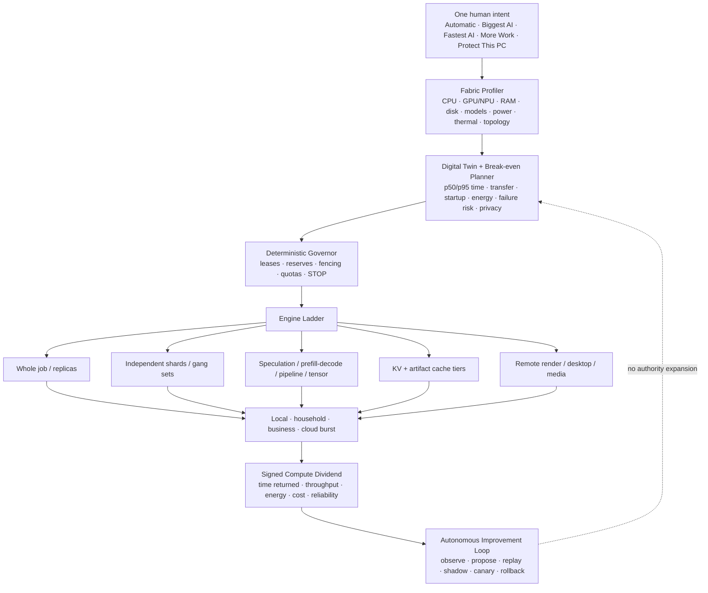

# Rampage Pioneer Architecture 2026

## The product thesis

Rampage should become the **evidence-bearing operating system for useful compute**.

It is not one inference engine, one remote-desktop product, one cloud marketplace, or one storage
system. It is the owner-controlled control plane that discovers what each device can really do,
selects the correct execution pattern, proves whether the split helped, and keeps the simple answer
visible:

> **What did my fabric accomplish, and what time did it return to me?**

The defensible product is not a claim that unrelated memory or VRAM becomes one magic address space.
The product is an adaptive fabric that can compose whole jobs, independent shards, replicas,
pipeline stages, tensor ranks, speculative draft/verify pairs, prefill/decode stages, cache tiers,
storage fragments, and remote media streams when measurements show that the composition wins.

The goal is a one-click product for a household and a policy-rich platform for a business, using the
same trust kernel.

## What the field already proves

The following systems are useful reference points, not dependencies Rampage must copy wholesale.

| System or research | What it proves | What Rampage should do better |
| --- | --- | --- |
| [Prima.cpp](https://openreview.net/pdf?id=h0LjpOG1jq) | Heterogeneous home machines can serve 30–70B models by co-optimizing CPU, GPU, RAM, disk, communication, and pipeline order. | Qualify this class of engine behind signed capability offers, owner reserves, install/recovery UX, and before/after receipts. |
| [exo](https://github.com/exo-explore/exo) | Automatic discovery and topology-aware model partitioning can make local device clusters approachable. | Support more than an inference runtime and reject a partition when measured end-to-end latency is worse than a whole-model route. |
| [llama.cpp RPC](https://github.com/ggml-org/llama.cpp/blob/master/tools/rpc/README.md) | A widely used local runtime can offload computation to remote RPC servers. | Never expose raw RPC. Pin patched versions, sandbox the adapter, put it behind Rampage authentication, and honor the project's [remote-code-execution advisory](https://github.com/ggml-org/llama.cpp/security/advisories/GHSA-j8rj-fmpv-wcxw). |
| [Petals](https://arxiv.org/abs/2209.01188) | Model layers can be collaboratively hosted across many machines and networks. | Optimize first for private, stable owner fabrics; introduce untrusted public peers only as a separate economic and privacy domain. |
| [vLLM distributed serving](https://docs.vllm.ai/en/latest/serving/distributed_serving.html) and [Ray placement groups](https://docs.ray.io/en/latest/ray-core/scheduling/placement-group.html) | Homogeneous GPU fleets benefit from tensor/pipeline parallelism and atomic gang placement. | Present this as an automatically qualified engine profile, not a cluster-administration exercise. |
| [TensorRT-LLM disaggregated serving](https://nvidia.github.io/TensorRT-LLM/features/disagg-serving.html), its [KV connector](https://nvidia.github.io/TensorRT-LLM/features/kv-cache-connector.html), [NVIDIA Dynamo](https://github.com/ai-dynamo), and [LMCache](https://github.com/LMCache/LMCache) | Prefill and decode can be separated; KV state can move through RAM, NVMe, and network tiers; routing can be prefix- and load-aware. | Build a vendor-neutral cache and request-placement plane with signed freshness, privacy labels, measured transfer cost, and graceful whole-model fallback. |
| [FlexGen](https://openreview.net/pdf?id=RRntzKrBTp) | GPU, CPU, and disk can be scheduled together to run models beyond GPU memory, especially for throughput-oriented work. | Autotune for the owner's latency or throughput intent and compare local offload against multi-node and cloud-burst alternatives. |
| [Kueue topology-aware scheduling](https://kueue.sigs.k8s.io/docs/concepts/topology_aware_scheduling/), [Ray scheduling](https://docs.ray.io/en/latest/ray-core/scheduling/index.html), and [Dominant Resource Fairness](https://www2.eecs.berkeley.edu/Pubs/TechRpts/2011/EECS-2011-18.html) | Network topology, gang admission, quotas, and multi-resource fairness materially affect distributed performance. | Apply these ideas to consumer devices while protecting the person currently using each device. |
| [Tailscale NAT traversal](https://tailscale.com/blog/how-nat-traversal-works) | Immediate relay connectivity can run in parallel with direct-path discovery and later upgrade to the better path without exposing user complexity. | Keep the existing owner-operated Rampage relay, race bounded paths, retain end-to-end Rampage identity, and publish path evidence. |
| [Bacalhau](https://bacalhau.org/docs/overview/architecture) | Moving compute to data, pluggable execution engines, and disconnected operation reduce transfer and central dependencies. | Add content-addressed data locality to every placement score and make each result independently verifiable. |
| [SkyPilot](https://docs.skypilot.co/en/latest/overview.html) | Clouds, Kubernetes, Slurm, and existing machines can be presented as one AI execution pool. | Add private personal devices and consumer UX, then choose owned or rented capacity from the same measured break-even model. |
| [Golem](https://docs.golem.network/docs/golem/overview) and [Akash](https://akash.network/docs/learn/core-concepts/deployments/) | Offers, demands, leases, resource pricing, and provider competition can form a compute market. | First produce a private household/business compute ledger; make any future marketplace opt-in, privacy-separated, reputation-weighted, and payment-rail agnostic. |
| [Ceph CRUSH](https://docs.ceph.com/en/latest/rados/operations/crush-map/) and [erasure coding](https://docs.ceph.com/en/umbrella/rados/operations/erasure-code/) | Data should be placed across explicit failure domains; large durable objects can use less space than full replication. | Retain encrypted content-addressing and possession proofs while adding household-aware failure domains and size-sensitive replication/erasure policy. |
| [RustDesk](https://rustdesk.com/docs) and [Sunshine](https://docs.lizardbyte.dev/projects/sunshine/latest/) | Self-hosted remote access and hardware-accelerated media paths can be responsive and cross-platform. | Reuse the already paired Rampage trust relationship, auto-select codecs, expose a visible consent state, and coordinate remote use with compute reservations. |
| [BOINC](https://boinc.berkeley.edu/boinc_a_platform_for_volunteer_computing.pdf) | Huge quantities of otherwise idle compute can finish restart-tolerant independent work. | Add modern isolation, local-first privacy, signed result evidence, thermal/energy gates, and useful mobile foreground roles. |
| [WCAG 2.2 target sizing](https://www.w3.org/WAI/WCAG22/Understanding/target-size-minimum) | A polished interface must remain operable for people who cannot accurately hit tiny controls. | Make the default experience readable, keyboard-visible, and outcome-first while keeping engineering detail behind disclosure. |

## The differentiated architecture



### 1. A capability graph, not a device list

Every offer should become a vertex in a continuously refreshed capability graph. Edges represent
measured relationships: latency, throughput, jitter, loss, relay cost, data locality, shared failure
domain, model compatibility, and trust domain. Vertices should include more than raw capacity:

- exact adapter, operation, runtime digest, driver/runtime ABI, and qualification level;
- capacity and safely available capacity after the owner's reserve;
- model artifact and KV-prefix locality;
- energy source, thermal trajectory, battery state, and foreground activity;
- reliability history, recent failure mode, restart cost, and result-verification strength;
- privacy and data-residency labels;
- device, power, network, room/site, and organization failure domains.

Logical resources are admission signals, not physical enforcement. Each executor must also apply OS-
level CPU, memory, GPU, process, filesystem, and network containment appropriate to the platform.

### 2. A measured break-even planner

For every candidate execution plan, estimate a distribution rather than a single optimistic number:

```text
completion_time = queue + cold_start + input_transfer + compute + synchronization
                + output_transfer + expected_retry_cost

utility = owner_value(completion_time, throughput, quality)
        - energy_cost - rental_cost - foreground_interference - privacy_risk
```

The planner should choose a distributed plan only when its conservative p90 estimate beats the best
whole-node plan by a configurable safety margin. The default margin can be learned per workload
class, never globally relaxed. The explanation stays simple: **why this plan**, **what could make it
slower**, and **what Rampage will do if a node disappears**.

### 3. An engine ladder instead of one universal runtime

Rampage should qualify adapters in this order:

1. **Whole-model placement.** The lowest-risk default for one request.
2. **Replicated serving with prefix-aware routing.** The best general throughput and failover win.
3. **Speculative draft/verify.** Let a smaller or edge model draft; let the authoritative model verify.
4. **Prefill/decode separation.** Use high-compute devices for prompt ingestion and high-bandwidth
   devices for token generation only when measured KV transfer wins.
5. **Heterogeneous pipelined ring.** A Prima.cpp-class adapter for mixed Windows/Linux CPU, GPU,
   RAM, disk, and Wi-Fi home clusters.
6. **Homogeneous tensor/pipeline engines.** vLLM/Ray or TensorRT/Dynamo for qualified GPU servers.
7. **Local CPU/RAM/NVMe offload.** A FlexGen/llama.cpp-class path when fitting the model matters
   more than interactive latency.
8. **Cloud or marketplace burst.** Use external capacity only when policy, privacy, price, and the
   signed performance envelope beat the owned fabric.

An adapter begins as `candidate`, runs deterministic conformance and topology benchmarks, then earns
`qualified` status only for the exact runtime digest and hardware/link envelope it proved. A raw
engine process never receives fabric identity or policy authority.

### 4. Network Autopilot

Joining should feel immediate even across difficult networks:

- establish the owner relay path first when needed;
- concurrently gather and race direct endpoint candidates;
- keep end-to-end workload identity and encryption above every path;
- migrate new streams to the winning direct path without interrupting admitted work;
- maintain separate traffic classes for leases/STOP, interactive tokens, remote media, artifacts,
  and bulk background work;
- learn p50/p95/jitter/loss profiles by time of day and power/network state;
- detect asymmetric links and choose split direction accordingly;
- cap probing so measurement can never starve heartbeats or admitted work.

The product language should be **Direct**, **Owner relay**, or **Recovering**—not NAT vocabulary.

### 5. Memory and storage that help without pretending to be local RAM

Rampage can make other machines' memory and drives valuable through explicit tiers:

- artifact CAS and model-weight cache;
- read-through hot-object RAM cache;
- external KV cache with tenant/model/tokenizer/privacy identity in its key;
- prefetch and placement beside the next executor;
- resumable transfer and possession challenges;
- full replication for small/high-value objects;
- erasure-coded fragments for large cold objects when enough independent failure domains exist;
- scratch workspaces that can be destroyed without affecting protected artifacts.

The UI should say **cache**, **model capacity**, **artifact capacity**, or **KV capacity**. It should
never imply that commodity network memory has local-RAM latency or coherence.

### 6. Gaming, creative production, and remote work

The same scheduler can create material value outside LLM inference:

- render-frame and video-transcode shards;
- shader or asset preprocessing, build/test matrices, and simulation sweeps;
- remote app or desktop sessions backed by automatic hardware codec selection;
- game-server, compilation, download/decompression, recording, and streaming support on a spare PC;
- background AI inference moved away from the gaming or editing machine;
- a `Protect This PC` governor that reserves latency, frame time, thermals, and network headroom.

Directly accelerating an arbitrary game across Ethernet is usually unrealistic. The honest win is to
remove competing work, host separable services, precompute assets, or remote-render the entire app on
the better GPU. Each workload adapter must define what is actually separable.

### 7. Edge devices with useful, bounded roles

Phones and tablets should not advertise fictional VRAM pooling. Useful roles include:

- embeddings, reranking, classification, validation, and small-model speculative drafts;
- camera/audio preprocessing that keeps raw sensor data local;
- cache/relay service while powered and thermally safe;
- restart-tolerant evaluation, search, and preprocessing shards;
- second-factor presence and owner-visible recovery—not compute authority.

Sustained benchmarks should report throughput, power, thermal throttling, and quality together. A
fast first minute followed by throttling is not a qualified sustained profile.

## The Compute Dividend contract

Utilization is an internal metric. The owner deserves an outcome.

Rampage should derive a **Compute Dividend** from signed receipts and a declared baseline:

```text
effective_scale = measured_fabric_rate / measured_fastest_node_rate
verified_extra_capacity = max(effective_scale - 1, 0)
time_saved = max(1 - 1 / effective_scale, 0)
time_returned_per_100_hours = 100 * time_saved
```

This release begins with concurrent sustained CPU proof and labels the result as applicable only to
matching fully divisible work. Future receipts may add:

- completed units and wall-clock time against a single-node counterfactual;
- p50/p95 latency, tokens per second, time to first token, and accepted speculative-token rate;
- joules measured with vendor/platform counters and energy per useful result;
- owner-supplied electricity and rental prices;
- retries, checkpoint recoveries, and avoided recomputation;
- cost avoided relative to a user-selected cloud SKU;
- carbon intensity only when the energy and location/time inputs meet an explicit standard such as
  the [Software Carbon Intensity specification](https://sci.greensoftware.foundation/).

Money, energy, and carbon must remain absent—not estimated from marketing constants—until their
inputs are measured or explicitly supplied. NVIDIA GPU energy can use supported NVML counters
documented in the [NVML reference](https://docs.nvidia.com/deploy/pdf/NVML_API_Reference_Guide.pdf);
other vendors and CPUs require equally qualified sources.

## Autonomous improvement without autonomous authority

The self-improvement loop should optimize a versioned policy, never rewrite its own authority:

1. **Observe:** bottlenecks, failures, queue delay, thermal pressure, transfer waste, and placement
   regret from signed evidence.
2. **Propose:** a typed, bounded change to weights, thresholds, chunk size, replication, prefetch, or
   engine selection.
3. **Replay:** evaluate the proposal against recorded workloads in a deterministic digital twin.
4. **Shadow:** compute the alternative decision without affecting live work.
5. **Canary:** apply only inside a small resource/time/error budget.
6. **Promote or roll back:** require a statistically meaningful improvement and no guardrail
   regression.

Automatically promotable changes should be narrowly allowlisted: placement weights, bounded timeouts,
cache policies, chunk sizes, and equivalent low-risk parameters. Identity, enrollment, lease scope,
STOP, privacy, data export, executable allowlists, payment, and policy ceilings remain deterministic
and outside the learning system's authority.

## The one-screen experience

### Default path

1. Install.
2. Rampage finds the owner or becomes the owner.
3. The owner sees **New machine found** and approves the named device.
4. Rampage automatically profiles it without freezing the desktop.
5. The home screen says **Ready**, **What Rampage can help with**, and **Last verified dividend**.

The default setting is **Automatic**. The four visible outcome overrides remain:

- **Biggest AI** — fit the largest qualified model;
- **Fastest AI** — minimize interactive latency;
- **More Work** — maximize completed parallel throughput;
- **Protect This PC** — preserve the foreground experience.

Everything else belongs in contextual explanations or an advanced disclosure. Users should choose an
outcome, not tensor ranks, relay servers, cache block sizes, or scheduling algorithms.

### Required product surfaces

- **Now:** one sentence describing what the fabric is doing.
- **Next:** the single highest-value action Rampage can take.
- **Dividend:** time, throughput, and later measured cost/energy returned.
- **Why:** the evidence behind the current placement in plain language.
- **Health:** a direct repair action when any device, path, model, or sidecar degrades.
- **Details:** receipts, topology, policy, and engine internals for experts.

All primary controls should be at least 40 CSS pixels high, visibly keyboard focusable, readable at
100% display scaling, and operable without relying on the 3D arena. The arena is a powerful spatial
explanation, not the only control surface.

## Delivery sequence

### Now: shipped in this change

- Replace exhaustive agent process enumeration with a bounded CPU/RAM resource probe.
- Turn signed sustained benchmark receipts into an explicitly scoped Compute Dividend.
- Revalidate each benchmark aggregate against its exact all-or-nothing shard set and accepted signed
  execution receipts before committing it to the hash-chained ledger.
- Persist a bounded Compute Dividend history with ledger sequence, recorded time, prior scale, and
  percentage change; restore the newest proof automatically after an app or controller restart.
- Add five typed workload profiles and a conservative p90 break-even planner that charges compute,
  startup, complete remote input/output transfer, round trips, and retry reserve. Plans with stale
  dividends, missing offers, missing link evidence, non-restart-tolerant work, or insufficient gain
  stay on the fastest node automatically.
- Keep the selected same-LAN direct address and owner relay in one authenticated Iroh endpoint set,
  allowing relay establishment and direct-path upgrade without changing fabric identity. Link
  receipts now report whether the active path was direct or owner relay when the transport can prove
  it.
- Add Network Autopilot traffic gates for authority control, interactive AI, remote media,
  artifacts, and bulk background work. Only bounded authority traffic may use an unmeasured
  authenticated fallback; performance traffic waits for fresh end-to-end measurements.
- Show durable dividend history, the p90 keep/distribute decision, and plain-language Direct, Owner
  relay, or Recovering state in the native Work surface.
- Increase functional-surface readability, target size, and focus visibility.
- Publish this architecture and qualification sequence.

### Phase 1: prove repeatable value

- Add per-node contribution, interference, thermal trajectory, and recovery-time receipts.
- Accumulate jitter, loss, time-of-day, and path-switch history so Network Autopilot can predict p95
  behavior rather than relying on the current fresh link envelope alone.
- Bind each production adapter to its own before/after qualification campaign; the current dividend
  remains a projection for matching divisible CPU work, not a generic acceleration claim.

### Phase 2: make local AI materially larger and faster

- Add replicated serving with prefix-aware routing and encrypted KV-directory metadata.
- Qualify one heterogeneous home-cluster engine through the external manifest contract.
- Qualify vLLM/Ray for homogeneous server GPUs and an Apple/MLX profile where supported.
- Add small-model speculative drafting on spare devices.
- Prototype prefill/decode split; promote only on topologies whose transfer proof wins.
- Add CPU/RAM/NVMe offload profiles for maximum-model-size mode.

### Phase 3: universal business fabric

- Add signed container/WASM workload adapters with network/filesystem policy and reproducible inputs.
- Add organization tenants, quotas, fair sharing, audit export, and data-residency labels.
- Add cloud/Kubernetes/Slurm import behind the same capability graph and dividend ledger.
- Add failure-domain-aware erasure coding for qualified large artifacts.
- Add measured energy/cost accounting and budget-aware placement.
- Add enterprise remote application streaming and hardware-codec qualification.

### Phase 4: opt-in economic network

- Let trusted groups exchange signed capacity offers before considering an open marketplace.
- Add provider reputation based on verified completion, latency, availability, disputes, and hardware
  attestation—not self-reported specs.
- Separate household identity, business tenancy, public provider identity, payments, and data policy.
- Support multiple payment rails and ordinary invoicing; never make a token a prerequisite for local
  or private-fabric value.

## Promotion gates

No engine or feature may be marketed as accelerating a workload until its release evidence includes:

1. exact source/runtime/artifact digests;
2. supported hardware, OS, driver, model, and topology envelope;
3. isolated single-node baseline and concurrent fabric measurement;
4. p50/p95 startup, transfer, execution, and end-to-end latency;
5. result-integrity and output-equivalence checks;
6. node loss, controller restart, relay loss, stale lease, and partial artifact recovery;
7. foreground interference, thermals, battery, storage pressure, and STOP behavior;
8. a signed receipt chain and independently reproducible command;
9. plain-language applicability and non-applicability statements;
10. rollback and automatic downgrade to a safer whole-job path.

That discipline is how Rampage can be ambitious enough to matter and trustworthy enough to install
on every machine.
