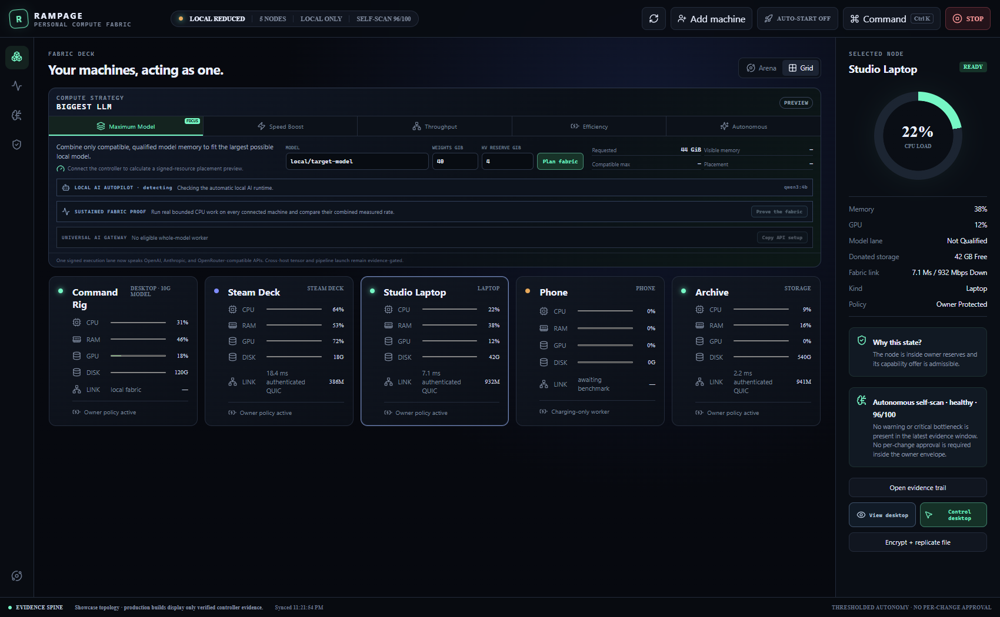

# Rampage 0.3.0 release evidence

This page is the qualification ledger for the Rampage 0.3.0 Remote Assist release. It distinguishes
source verification, locally assembled packages, public release artifacts, and physical two-machine
operation. A later row must not be inferred from an earlier one.

## Capability boundary

The paired worker must explicitly enable Remote Assist. Only its pinned owner controller may request a
session, and the deterministic Governor issues an exact signed lease lasting no more than 30 seconds.
The worker displays active access, accepts one session at a time, persists replay fences across agent
restart, and revokes access on toggle-off or STOP. The AI proposal service has no enrollment key,
controller key, lease-signing key, desktop API, or STOP-bypass authority.

Windows secure-desktop and integrity boundaries remain authoritative. Rampage does not control UAC,
the lock screen, the secure desktop, higher-integrity applications, a shell, or elevation.

## Verification ledger

| Layer | Command or receipt | Result |
| --- | --- | --- |
| Protocol and Governor | `cargo test -p rampage-protocol -p rampage-policy` | PASS — 15 protocol and 23 policy tests |
| Worker Remote Assist | `cargo test -p rampage-agent remote_assist -- --nocapture` | PASS — opt-in, signed heartbeat, visible marker, durable replay fence |
| Authenticated mesh frame | `cargo test -p rampage-mesh remote_desktop_frame_is_request_scoped_and_digest_checked` | PASS — dedicated QUIC ALPN, request binding, digest check |
| Desktop contracts | `npm.cmd test -- --run` in `apps/desktop` | PASS — 15 tests |
| Desktop production bundle | `npm.cmd run build` in `apps/desktop` | PASS — known size and duplicate-Three warnings only |
| Version coherence | `scripts/Assert-RampageVersion.ps1 -Tag v0.3.0` | PASS — nine release surfaces |
| Full source campaign | `scripts/Test-Rampage.ps1 -SkipOllama` | PASS — uninterrupted Rust, clippy, desktop, edge, TypeScript SDK, Python lint/type/test, fresh sidecar build, controller lifecycle, mesh/storage, and universal model-gateway campaign |
| Native Windows package | `scripts/Build-Rampage.ps1 -Profile release` and `scripts/Smoke-RampageInstaller.ps1` | PASS — MSI + NSIS built; NSIS installed six payloads, created both shortcuts, started a ready local fabric, closed cleanly, uninstalled cleanly, and leaked no sidecar |
| Public release artifacts | [v0.3.0-remote-assist.1](https://github.com/ObtuseAI/rampage/releases/tag/v0.3.0-remote-assist.1) | PASS — published against merged commit `26f1a6cf455ab6efb90f6c99181965d77cec924b`; all four assets independently downloaded and rehashed |
| Physical owner-to-laptop view/control | Requires 0.3.0 on both physical machines | PENDING — not replaced by the showcase image |

## Source-current showcase

This image was rendered from the current desktop source with labeled demonstration topology. It proves
the current UI contract and presentation, not physical packet transport or Windows input injection.

## Packaging and publication

| Artifact | Bytes | SHA-256 |
| --- | ---: | --- |
| `Rampage_0.3.0_x64_en-US.msi` | 79,257,600 | `bef9d4531b3829f776d6f6217788d0f7a0b35a16c155e7d21d0d8c97b57a8ad4` |
| `Rampage_0.3.0_x64-setup.exe` | 69,348,237 | `bb3dbf25ea8485e2c9cee16ceb36d8f07db03ae736265deb0df5295f733b6b52` |

The NSIS smoke installed all six payloads into an isolated directory; verified the Desktop shortcut
and Rampage Shell shortcut; observed ready controller and proposal-only intelligence services, one
local node, and one signed offer; then verified clean exit, uninstall, shortcut removal, and no leaked
sidecar. The MSI was assembled and hashed but was not installed in this local campaign.

`scripts/Validate-Showcase.ps1` passed with 11 local references, the 1200x630 social preview, the
source-current screenshot, and architecture graph present. `scripts/Assert-RampageVersion.ps1 -Tag
v0.3.0` passed all nine release surfaces.

The clean distribution stage binds the artifacts to merged commit
`26f1a6cf455ab6efb90f6c99181965d77cec924b`. The public release was independently downloaded after
publication: both installer byte sizes and SHA-256 values matched the table, the checksum file was 190
bytes with SHA-256 `f6fe2f18d26486a8f5483a71c34ef4556ef5d4843dd4e872ced9a9a201cc9bf4`, and the 666-byte distribution
manifest had SHA-256 `9ed0f8345cd78ed9badc8ecc8a43edc72e542d425af9e26b387bd0bb87602445`.

The release is public, non-draft, and non-prerelease. It remains unsigned because Authenticode
credentials were not configured and the distribution manifest correctly records
`platform_signature_verified: false`.
