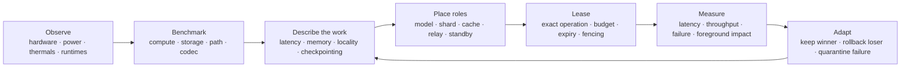

# Rampage universal fabric blueprint

This is the engineering map for making Rampage broadly useful without confusing networked machines
with one physically coherent motherboard. It separates what is **shipped**, what can be **qualified by
an adapter**, and what remains **experimental**. A capability does not gain execution authority merely
because it appears in this document.

## The one-screen product

Rampage should make the technical decisions and expose outcomes:

| Choice | User intent | Automatic fabric behavior |
| --- | --- | --- |
| **Automatic** | Make this machine and its work feel better | Continuously choose the highest measured benefit within the owner's standing limits |
| **Biggest AI** | Run the largest model that can be served correctly | Prefer one complete-model host, then qualified pipeline/tensor topologies only when memory and link gates pass |
| **Fastest AI** | Minimize time to first and next token | Prefer the fastest whole-model host, replicas, prefix locality, speculative work, and disaggregated stages only when measured faster |
| **More Work** | Maximize total completed work | Replicate services and spread independent agents, batches, builds, renders, evaluations, and transforms |
| **Protect This PC** | Keep the foreground game, call, render, or creative session smooth | Evacuate background work, cap local pressure, and spend remote capacity first |

There is no manual CPU/GPU/cache/relay role picker in the normal path. Every device advertises
facts; the controller assigns short-lived roles per workload. Advanced controls remain available for
diagnosis, but a new user sees one recommendation and four understandable alternatives.

## The automatic role engine

A laptop can be a whole-model server for one request, a build worker for the next, and a cache or
relay later. A phone normally becomes a control surface, sensor source, foreground-safe evaluator,
or small-model worker—not fake shared VRAM. A GPU server can advertise several independently
qualified engines without giving Rampage shell access to the host.

The owner defines the standing envelope once. Inside it, deterministic thresholds can adapt without
per-change prompts. A proposed change that tries to widen authority is denied rather than waiting for
the AI to approve itself. Pairing, worker Remote Assist opt-in, and STOP remain independent owner
security boundaries.

## One capability market, several execution lanes

| Lane | Best use | Admission rule | State |
| --- | --- | --- | --- |
| Whole-model placement | One interactive local LLM, game server, compiler, renderer, or tool on the strongest node | Exact installed runtime/model or application adapter; signed offer and result | Shipped for bounded Ollama text and independent jobs |
| Replicated service | Higher AI throughput, many agents, failover, render/build farms | Compatible artifacts and runtime digest; health and saturation routing | Shipped contract; adapters expand independently |
| Independent shards | Search, evaluation, tests, simulation, preprocessing, transcode, compilation units | Deterministic partition, deadline, minimum-success threshold, signed receipts | Shipped |
| Cross-node model | A model that cannot fit one qualified GPU/node | Engine-native tensor or pipeline plan; compatible devices; topology and failure proof | Planner shipped; execution gated |
| Prefill/decode split | Long prompts or high concurrency on differently shaped GPU pools | KV format match and transfer benchmark must beat aggregated serving | Experimental adapter |
| Speculative lane | Faster decode using spare smaller-model capacity | Tokenizer/model compatibility and measured acceptance/speed gain | Experimental adapter |
| Cache and storage | Model layers, build outputs, datasets, checkpoints, prefix/KV state where supported | Encrypted content addressing, quota, possession evidence, expiration | Artifact fabric shipped; engine caches gated |
| Interactive desktop | Help, administration, remote creative work, and game streaming | Paired identity, explicit worker opt-in, visible bounded session, codec/path qualification | Remote Assist shipped; low-latency media lane next |
| Network utility | Direct-path probe, private relay, store-and-forward, cache prepositioning | Owner-signed membership, rate caps, no arbitrary forwarding | Direct QUIC and owner relay shipped |

Ray Serve LLM documents tensor, pipeline, expert, replica, data-parallel attention, prefix-aware
routing, and prefill/decode patterns across nodes. NVIDIA Dynamo likewise separates prefill and
decode, but explicitly treats KV transfer as the critical path and warns that TCP fallback can make
the split slower. Rampage should therefore qualify these as engine adapters, never as a universal
promise. See the [Ray Serve LLM architecture](https://docs.ray.io/en/latest/serve/llm/architecture/overview.html),
[Ray cross-node parallelism](https://docs.ray.io/en/latest/serve/llm/user-guides/cross-node-parallelism.html),
and [NVIDIA Dynamo disaggregated serving guide](https://docs.nvidia.com/dynamo/latest/user-guides/disaggregated-serving).

### The large-model decision tree

1. If the model fits one live qualified node, place the complete model there. This normally gives the
   most predictable interactive latency.
2. If several nodes hold the complete model and traffic is concurrent, replicate and route by load,
   prefix locality, health, and energy/foreground cost.
3. If the model does not fit one node, search only compatible engine-native tensor/pipeline layouts.
4. Reject a layout when collective traffic, weakest-rank compute, transfer time, or failure recovery
   predicts a loss. Aggregate memory is a capacity ceiling, not proof of useful serving.
5. Evaluate prefill/decode separation and speculative decoding as measured alternatives, not assumed
   upgrades.

The llama.cpp RPC backend is not an acceptable shortcut today. Its own documentation calls it a
fragile, insecure proof of concept, and the project's current security guidance says not to expose
the RPC backend on untrusted networks. A critical unauthenticated RCE advisory lists no patched
version. Rampage must not launch or expose raw RPC until an independently reviewed safe upstream
version exists and passes the mesh adapter campaign. Sources:
[llama.cpp security guidance](https://github.com/ggml-org/llama.cpp/security),
[RPC proof-of-concept warning](https://github.com/ggml-org/llama.cpp/blob/master/tools/rpc/README.md),
and [GHSA-j8rj-fmpv-wcxw](https://github.com/ggml-org/llama.cpp/security/advisories/GHSA-j8rj-fmpv-wcxw).

## Network Autopilot

Rampage should optimize the path as carefully as the placement:

1. Probe direct IPv4/IPv6 and owner-relay candidates in parallel; retain authenticated path identity.
2. Measure RTT distribution, jitter, loss, reordering, goodput, MTU behavior, and sustained—not burst—
   transfer speed per direction.
3. Classify traffic: interactive input, video/audio, tokens, collectives, artifact transfer, evidence,
   and background repair do not share one congestion goal.
4. Choose direct or relay per session, then migrate only with continuity and replay fencing.
5. Apply adaptive bitrate, resolution, frame rate, codec, keyframe cadence, and bounded forward error
   correction to media; do not retransmit stale interactive frames.
6. Preposition immutable model/artifact chunks and resume by verified chunk digest rather than moving
   the same bytes for every job.
7. Reserve foreground headroom. **Protect This PC** lowers or evacuates background traffic when game,
   call, production, battery, thermal, or input-latency signals cross thresholds.
8. Continuously compare the observed result with the predicted result. Roll back routes or placements
   whose gain disappears.

These ideas follow observable industry patterns without copying proprietary implementations.
Parsec exposes separate network, encode, and decode latency and adjusts bitrate against congestion;
Sunshine exposes bitrate, hardware encoder, low-latency, and FEC controls; Microsoft notes that
remote-session quality depends strongly on available network capacity. Sources:
[Parsec latency guidance](https://support.parsec.app/hc/en-us/articles/32381352822804-Troubleshooting-Lag-Latency-and-Quality-Issues),
[Sunshine configuration](https://docs.lizardbyte.dev/projects/sunshine/latest/md_docs_2configuration.html),
and [Microsoft RDS network guidance](https://learn.microsoft.com/en-us/windows-server/remote/remote-desktop-services/network-guidance).

## Remote experience plane

Remote access products reveal three separate contracts that Rampage should keep separate:

| Contract | Rampage meaning |
| --- | --- |
| Connection eligibility | Only an identity paired into this owner fabric can request a session |
| In-session permission | View, keyboard/mouse, clipboard, file transfer, audio, controller, and administration are separate capabilities |
| Lifecycle and revocation | Active indication, expiry, disconnect, worker opt-out, owner forget, STOP, leave fabric, and factory reset |

RustDesk documents the same useful separation between access eligibility and in-session control
roles. Windows RDS demonstrates full desktop versus individually published applications. Rampage's
next remote adapter should add permission-scoped clipboard/file/audio/gamepad and application-window
streaming, while defaulting to the smallest capability that satisfies the task. Sources:
[RustDesk access control](https://rustdesk.com/docs/en/self-host/rustdesk-server-pro/permissions/),
[RustDesk control roles](https://rustdesk.com/docs/en/self-host/rustdesk-server-pro/control-role/),
and [Microsoft RDS overview](https://learn.microsoft.com/en-us/windows-server/remote/remote-desktop-services/overview).

The low-latency lane should use native capture, hardware encode/decode when available, a zero-copy
GPU path where proven, cursor/input prioritization, multi-monitor/window selection, audio and
gamepad channels, quality adaptation, and a visible latency breakdown. It must retain Rampage's
paired identity, short lease, worker indicator, opt-out, and STOP semantics.

## Self-improvement loop

Rampage can improve automatically without giving an AI administrator authority:

1. **Detect:** compare predictions to signed receipts, path telemetry, foreground impact, crashes,
   thermal throttling, retry storms, cache misses, and unused capacity.
2. **Diagnose:** produce a typed hypothesis with affected adapter, expected gain, rollback trigger,
   and evidence digest.
3. **Experiment:** replay or shadow first; then use a small traffic-, resource-, time-, and node-capped
   canary lease for allowlisted low-risk changes.
4. **Decide:** the Rust Governor checks immutable thresholds. All required gates pass or nothing is
   promoted.
5. **Watch:** compare canary and baseline with confidence and minimum sample requirements. Roll back
   automatically on any guardrail breach.
6. **Remember:** store proposal, environment, artifacts, outcomes, and failure class by content digest
   so the fabric does not repeat losing experiments.

No AI-issued peer enrollment, signing key access, lease minting, policy-envelope edits, STOP bypass,
or destructive machine access is part of this loop. Within the existing envelope, the system acts
without per-change approval; outside it, it fails closed.

## Qualification campaigns

Every new adapter must publish a machine-readable campaign covering:

- correctness against a single-node baseline;
- cold and warm latency, sustained throughput, and time-to-first-token/frame;
- weakest-link and heterogeneous-device behavior;
- restart, disconnect, packet loss, stale lease, duplicate request, and partial-result recovery;
- resource ceilings, foreground impact, thermal/battery response, and storage wear limits;
- artifact/model integrity, secret isolation, authenticated transport, and replay fencing;
- rollback and STOP behavior;
- a measured break-even surface that tells Autopilot when **not** to distribute.

The promotion unit is not “backend installed.” It is `(backend digest, operation, hardware class,
driver/runtime compatibility, topology class, security profile, campaign digest)`. Unknown
combinations remain candidate-only.

## Delivery sequence

| Stage | Deliverable | Completion evidence |
| --- | --- | --- |
| 0.3.1 | Recovery Center, Pair again, owner Forget, factory reset, automatic outcome-first UI, SDK lifecycle API | Native package, restart-safe tests, two-machine re-pair and Remote Assist receipt |
| Next | Network Autopilot v1 and remote media telemetry | Direct/relay path race, adaptive media proof, visible encode/network/decode latency |
| Next | Qualified multi-GPU server adapter | Homogeneous CUDA tensor/pipeline campaign that beats or enables the single-node baseline |
| Next | Replicated AI service and prefix-aware routing | Concurrent-load proof, failover, cache-hit evidence, bounded autoscaling |
| Experimental | Prefill/decode and speculative lanes | KV/token compatibility, transfer break-even, quality equality, rollback proof |
| Experimental | Production/gaming adapters | Per-application operation contract and foreground-impact proof; no generic FPS promises |
| Experimental | Expanded mobile roles | Physical battery, thermal, lifecycle, network, and store-signing qualification |

This ordering makes Rampage immediately easier to recover, then progressively faster and broader.
The interface can stay simple because complexity lives in signed capability discovery, measurements,
and adapter qualification—not in a settings maze.
